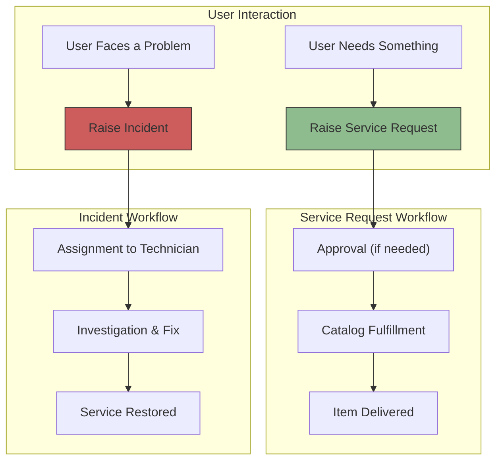

### ✅ Service Request vs. Incident – What’s the Difference?

---

### 📌 Overview

In IT Service Management (ITSM), it's crucial to distinguish between **Service Requests** and **Incidents**, as they follow **different workflows**, serve **different purposes**, and have **different urgencies**. Both are handled in ServiceNow, but understanding the difference ensures better ticket routing and faster resolutions.

---

### 🔄 Real-Life Example:

| Scenario                             | Classification     |
|--------------------------------------|---------------------|
| "I need a new mouse."                | ✅ Service Request  |
| "My mouse stopped working!"          | ❗ Incident          |

---

### 🧰 Definitions

#### 🟢 Service Request
A **user-initiated request** for a service or item—usually catalog-based and often pre-approved.

- **Examples**: 
  - Requesting new hardware
  - Asking for access to a shared folder
  - Requesting software installation

- **Workflow**:
  ```
  Request → Approval (if required) → Fulfillment
  ```

#### 🔴 Incident
An **unplanned interruption** or degradation of service that requires **urgent attention** and might be tied to **SLA timers**.

- **Examples**:
  - System outage
  - Hardware failure
  - VPN connectivity issue

- **Workflow**:
  ```
  Incident Logging → Assignment → Resolution
  ```

---

### 📊 Use Case Diagram



---

### 🧠 Key Differences

| Feature                  | Service Request                      | Incident                          |
|--------------------------|--------------------------------------|-----------------------------------|
| Purpose                  | Requesting something new             | Fixing an issue                   |
| Urgency                  | Usually low                          | Usually high                      |
| SLA Involvement          | Less critical                        | SLA starts ticking immediately    |
| Workflow Type            | Catalog-based                        | Resolution-focused                |
| Requires Troubleshooting | ❌ No                                 | ✅ Yes                             |

---

### 📎 Summary

> “Different workflows. Same platform. Know the difference.”

Understanding the right classification helps optimize resource allocation, streamline response times, and meet user expectations effectively — all while improving your ServiceNow implementation.
