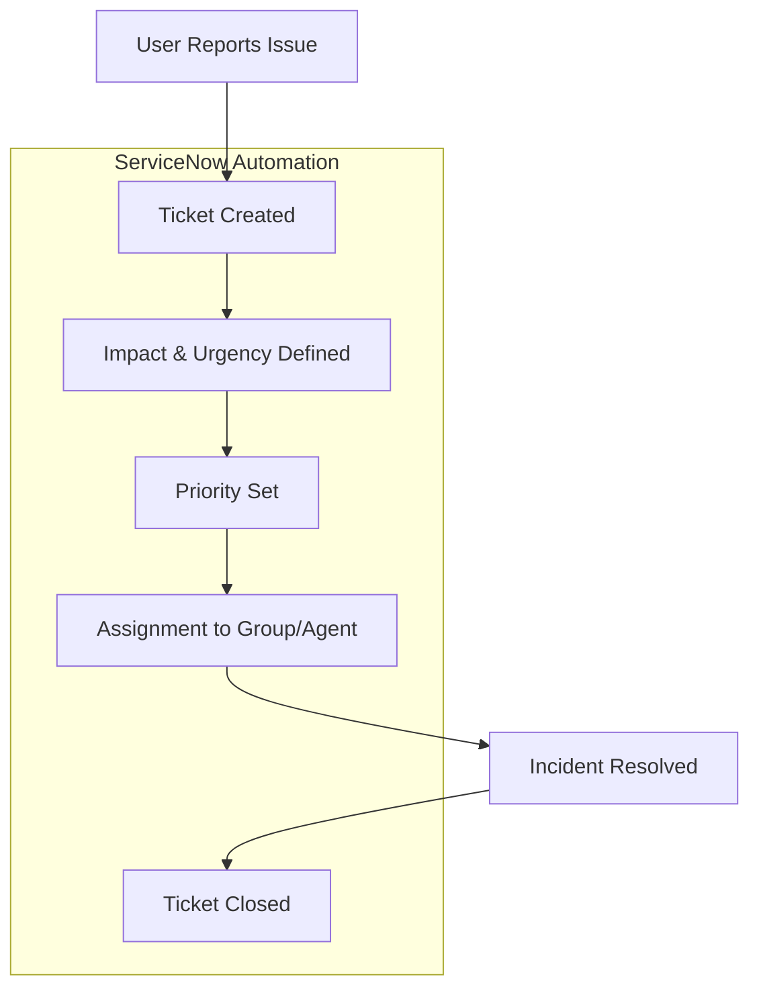

# 🚨 Incident Lifecycle — Step-by-Step

This repository outlines the **Incident Management Lifecycle** in 5 key stages, aligned with automation powered by **ServiceNow**. The workflow is ideal for IT teams handling incident tickets, ensuring timely resolution and SLA adherence.

---

## 🧩 Use Case Diagram

> This diagram showcases the interaction between a user and the automated incident management process. Stages inside the green box represent steps managed or triggered automatically by **ServiceNow**.

---

## 🔁 Lifecycle Stages Summary

| Stage | Description |
|-------|-------------|
| 🟥 **1. Ticket Created** | - SLA timer starts    - Notification-triggered |
| 🟧 **2. Impact & Urgency Defined** | - Priority (P1–P4) auto-calculated   - Notification sent |
| 🟥 **3. Priority Set** | - 🔴 P1 – 1-hour target (URGENT)   - 🟠 P2   - 🟡 P3   - 🔵 P4 – 72-hour target |
| 🟦 **4. Assignment** | - Auto-assignment rules   - Manual override allowed |
| 🟩 **5. Closed** | - Closure survey sent   - Ticket archived |

---

## ✅ Automation Powered by ServiceNow

Most stages in this lifecycle are supported by **ServiceNow automation**, including:
- SLA monitoring
- Priority calculation
- Auto-assignment logic
- Closure procedures

---

## 📁 Use Cases

- ITIL/ITSM Process Documentation  
- ServiceNow Workflow Review  
- DevOps & SysOps Training  
- Stakeholder Demonstrations

---
